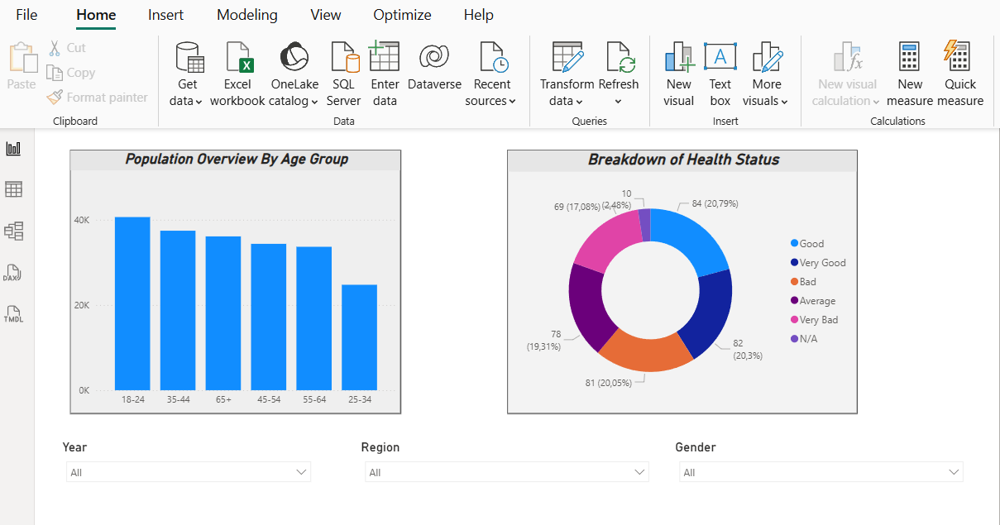
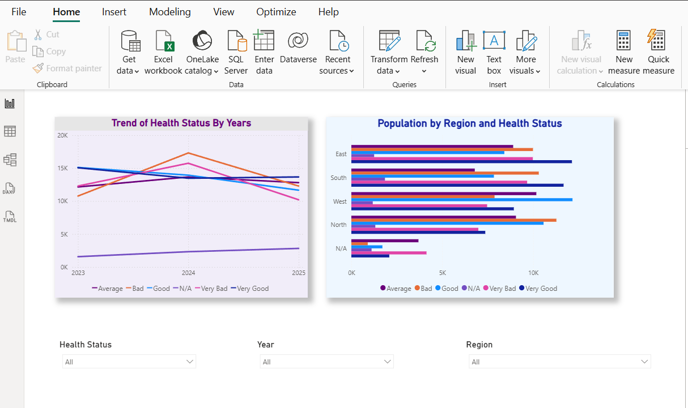

# health-demographics-powerbi
Power BI: data cleaning in Power Query + 2-page Health &amp; Demographics dashboard (overview + trends).

# Data Cleaning, Merging & Visualisation (Power BI)

## Project Overview
This project analyses a **Health Demographics** dataset in Power BI.  
I completed the full workflow: **data cleaning in Power Query → validation → dashboard build → insights**.

## What I Did

### Data Cleaning (Power Query)
Key transformation steps:
- Removed duplicates
- Replaced missing values with **"N/A"**
- Trimmed extra spaces in text fields
- Standardised text case across **Region**, **Gender**, and **Health Status**
- Validated correct data types for all columns

### Dashboard Build (2 pages)

**Page 1 — Overview**
- Donut chart: distribution of **Health Status**
- Stacked/segmented bar chart: **Age Group** by count, split by Health Status
- Slicers: **Year**, **Region**, **Gender**

**Page 2 — Trends**
- Line chart: **Health Status trends by year**
- Clustered bar chart: **Regions compared by Health Status**
- Slicers: **Health Status**, **Region**, **Year**

## Key Learning
The final dashboard quality depends heavily on data preparation.  
Small cleaning steps (trimming spaces, fixing types) significantly improved how smoothly visuals and filters worked.

## Screenshots

### Page 1 — Overview

### Page 2 — Trends

## Tools Used
Power BI • Power Query

## Files
- Health & Demographics Dashboard.pbix 
- Dataset
- Screenshots
